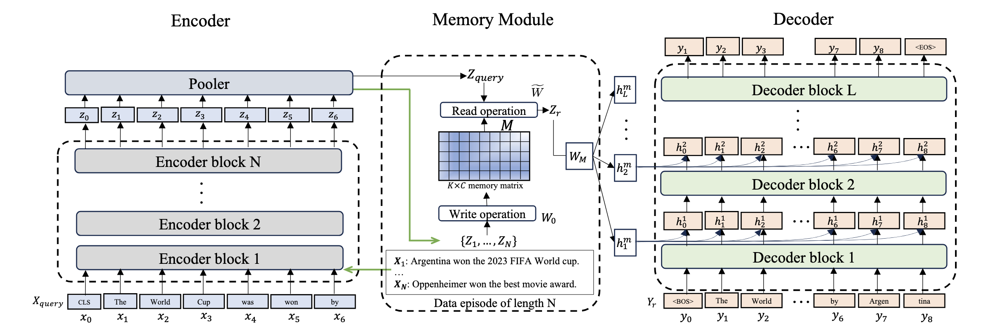

# Larimar
This repo contains a reference implementation of the paper 
[Larimar: Large Language Models with Episodic Memory Control](https://research.ibm.com/publications/larimar-large-language-models-with-episodic-memory-control).

<p align="center">  

</p>


## Install

```
conda create --prefix envs/larimar python=3.10 -y
conda activate envs/larimar
pip install -r requirements.txt
python -m nltk.downloader punkt_tab
python -m spacy download en_core_web_sm
```

## Use
Single-fact editing demo notebook: `larimar_base/single_fact_editing_demo.ipynb`


## Train
To train a `larimar-1.3b` model, first download and extract under `../data` [this dataset tarball](https://ibm.box.com/shared/static/00m2lawggdbb71x9ht1fdddzwss2y1wu.gz) and then: 

```
cd larimar_base/
bash train_larimar.sh
```
This will train the model with configuration C3 as in the paper. Please, adjust to your environment by editing related entries in `train_larimar.sh` and `configs/config_train_larimar.yaml` files before launching.


## Evaluate
Choose the larimar model to evaluate in `eval.sh`, `eval_rephrase.sh` and run:

```
cd larimar_base/
bash eval.sh
bash eval_rephrase.sh
```


## Citation
```
@misc{das2024larimarlargelanguagemodels,
      title={Larimar: Large Language Models with Episodic Memory Control}, 
      author={Payel Das and Subhajit Chaudhury and Elliot Nelson and Igor Melnyk and Sarath Swaminathan and Sihui Dai and Aurélie Lozano and Georgios Kollias and Vijil Chenthamarakshan and Jiří and Navrátil and Soham Dan and Pin-Yu Chen},
      year={2024},
      eprint={2403.11901},
      archivePrefix={arXiv},
      primaryClass={cs.LG},
      url={https://arxiv.org/abs/2403.11901}, 
}
```
